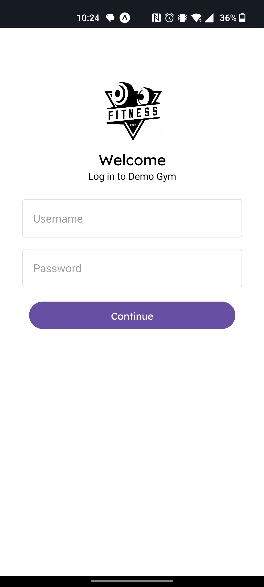
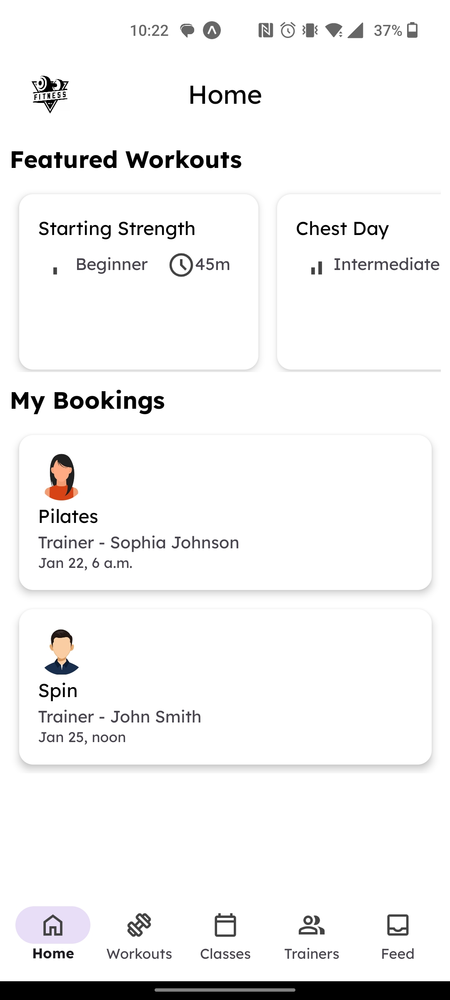
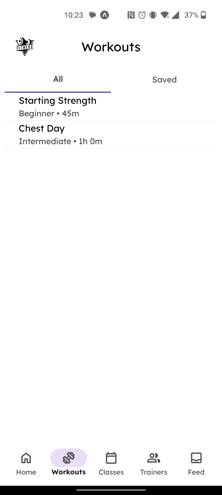
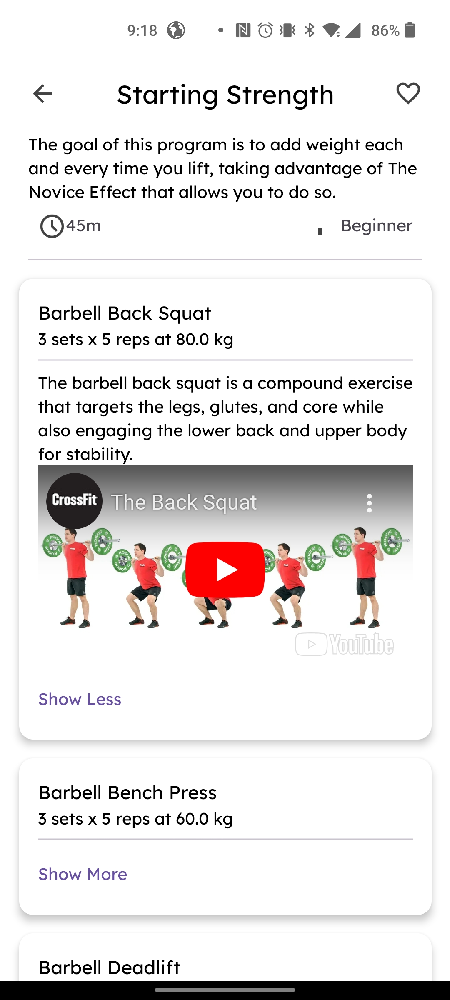
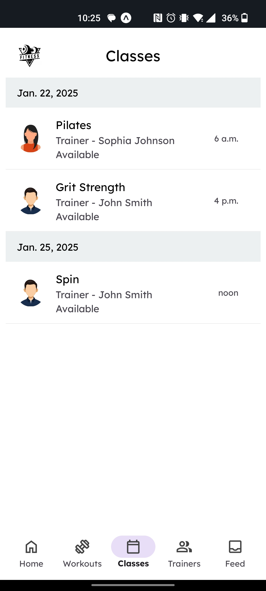
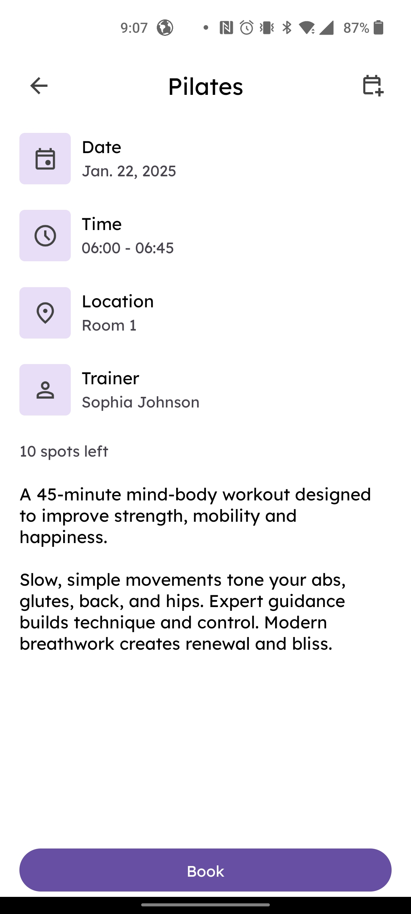
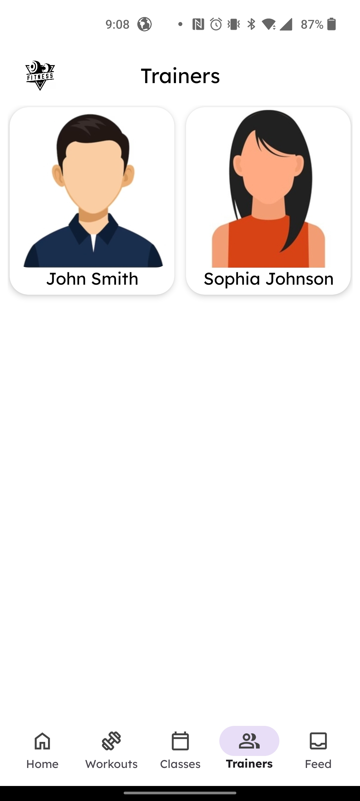
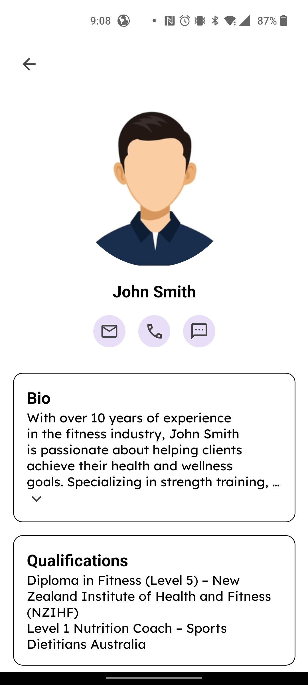
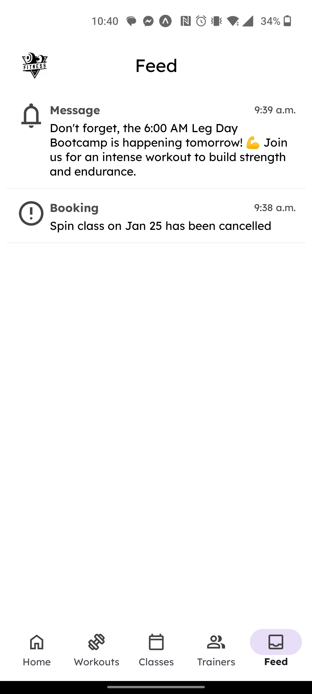

# Members App

Welcome to the Members App! This project is a comprehensive web/mobile application designed to manage workouts, classes, trainers, and notifications. It is built using modern web technologies and follows best practices for scalability and maintainability.

## Overview

The Members App provides a platform for gym members to manage their workouts, book classes, receive notifications, and interact with trainers. It also includes tenant-specific branding, allowing each gym to customize the app with their own logos and colors.

## Technologies Used

- **Django**: A high-level Python web framework that encourages rapid development and clean, pragmatic design.
- **Django Rest Framework (DRF)**: A powerful and flexible toolkit for building Web APIs.
- **Celery**: An asynchronous task queue/job queue based on distributed message passing.
- **Redis**: An in-memory data structure store, used as a message broker by Celery.
- **PostgreSQL**: A powerful, open-source object-relational database system.
- **Hyperview**: A React Native framework that the mobile client runs on.
- **Docker**: A platform for developing, shipping, and running applications in containers.

## Features

### User Authentication

- Secure user authentication with token-based authentication.
- Tenant-specific branding and customization throughout the app.

### Workouts

- Users can save and manage their workouts.
- Featured workouts section on the home page.

### Classes

- Users can book and manage class bookings.
- Recurring classes and calendar integration.
- Notifications for class cancellations and reminders.

### Trainers

- Trainer profiles with messaging shortcuts.

### Notifications

- Real-time notifications for class bookings, cancellations, and reminders.
- Push notifications using Celery and Expo.

### Admin Dashboard

- Beautiful and responsive admin dashboard using Unfold.
- Tenant-specific admin interface for managing gym-specific settings.

## Usage

1. **Clone the repository**:
   ```sh
   git clone https://github.com/yourusername/members_app.git
   cd members_app
   ```

2. **Run the docker compose file**:
   ```sh
   docker compose up
   ```

## React Native App Screenshots

<table>
  <tr>
    <td>Login page</td>
    <td>Home page</td>
  </tr>
  <tr>
    <td></td>
    <td></td>
  </tr>
 </table>

<table>
  <tr>
    <td>Workouts page</td>
    <td>Workout and exercise details</td>
  </tr>
  <tr>
    <td></td>
    <td></td>
  </tr>
 </table>

<table>
  <tr>
    <td>Classes page</td>
    <td>Class booking page</td>
  </tr>
  <tr>
    <td></td>
    <td></td>
  </tr>
 </table>

<table>
  <tr>
    <td>Trainers page</td>
    <td>Trainers contact page</td>
  </tr>
  <tr>
    <td></td>
    <td></td>
  </tr>
 </table>

<table>
  <tr>
    <td>Feed page</td>
  </tr>
  <tr>
    <td></td>
  </tr>
 </table>